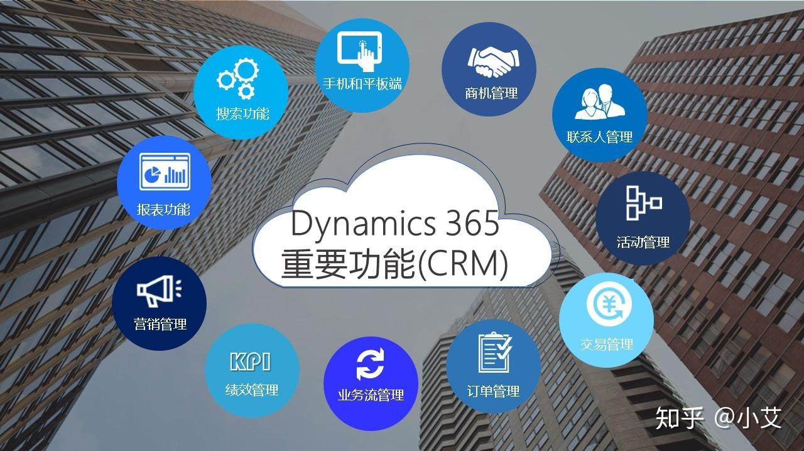
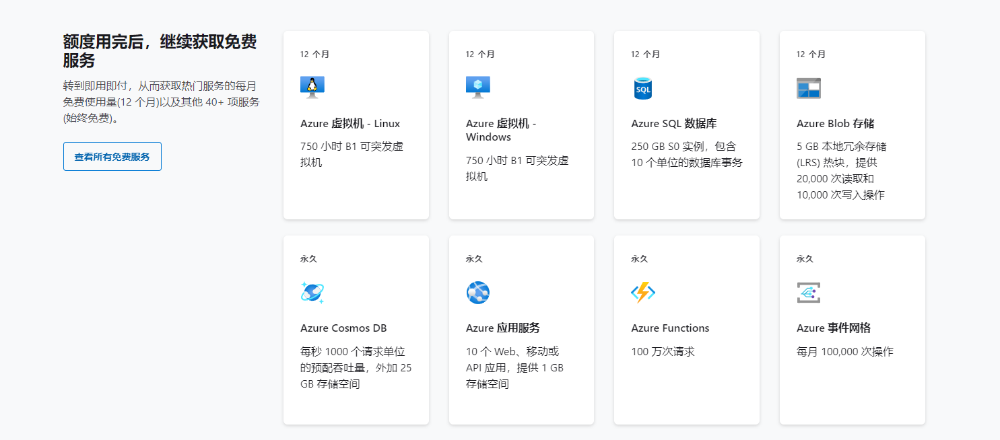
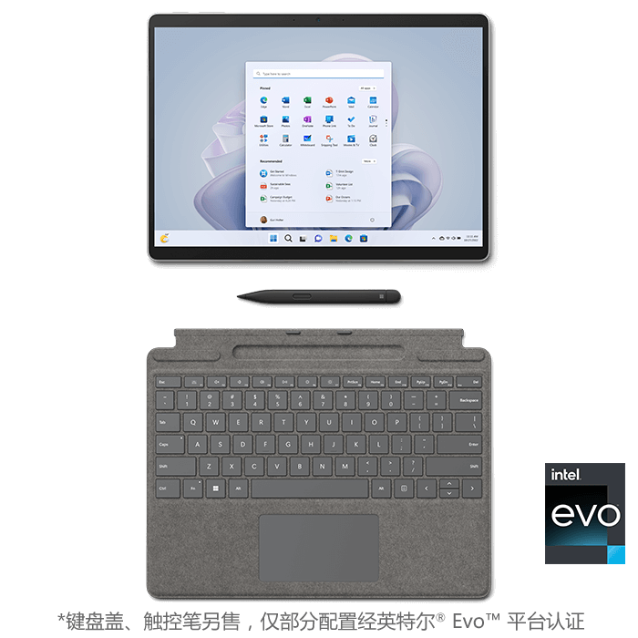
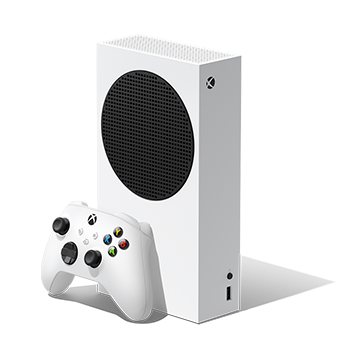
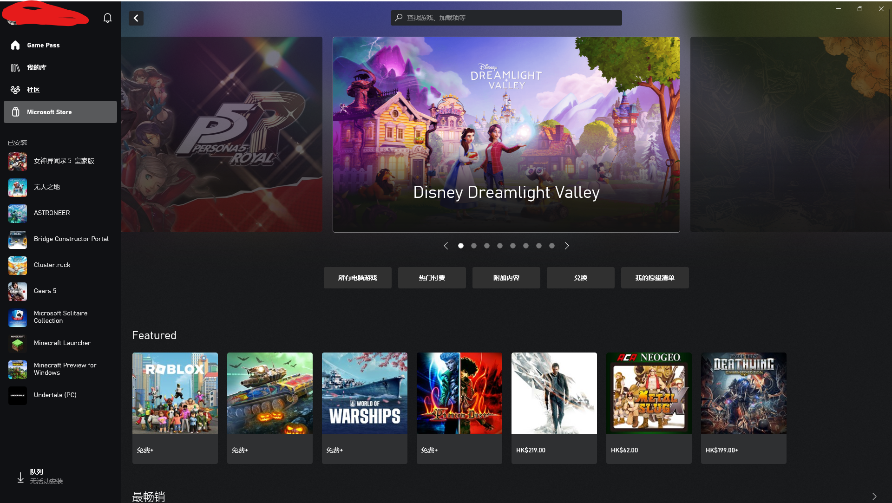

# 微软商业模式分析

## 1.价值主张

[微软财报](https://www.sec.gov/ix?doc=/Archives/edgar/data/789019/000156459022026876/msft-10k_20220630.htm#ITEM_7_MANAGEMENTS_DISCUSSION_ANALYSIS_F)  
微软将其的主要产品与服务分为两大类.  

1. 生产力,业务流程及智能云
2. 更多个人计算

### 在生产力,业务流程及智能云中包含以下几类产品

1.office商用产品及云服务  
  
注:office 365已更名为Microsoft 365  
2.offce消费者产品及云服务  
  

>该业务为to **to B**,to C,to G,解决了用户办公的问题  
>微软在这个方面的的主要竞争对手有金山wps和谷歌 google work space  
>[google workspace与Microsoft 365比较](https://www.kocpc.com.tw/archives/367529)

3.Dynamics产品和云服务  
Dynamics 365 是运行于云端的新一代 SaaS（软件即应用）级别的智能商业应用，能够为企业提供现代、统一、智能、灵活、合规的客户关系管理（CRM）与企业资源计划（ERP）服务.  
  

>该产品的主要竞争对手有Salesforce
>[dynamics优势](http://cloud.idcquan.com/yzx/161726.shtml)

4.LinkedIn-一个面向职场的社交平台  
  
5.服务器产品和云服务  
包括Azure和其他云服务;SQL Server、Windows Server、Visual Studio、System Center(数据中心管理) 和相关的 Client Access Licenses （“CAL”一个赋予用户访问服务器端服务权限的授权）;以及 Nuance(从事语音识别软件、图像处理软件及输入法软件研发、销售) 和 GitHub  
  

>在该领域微软竞争对手较多包括aws,oracle等
>[azure优缺点](https://www.vsdiffer.com/proscons/pros-and-cons-of-azure.html)

### 在更多个人计算中包括以下几类产品

1.通过 OEM 渠道销售的 Windows 专业版和非专业版许可证  
2.Windows Commercial 产品和云服务-包括 Windows 操作系统、Windows 云服务和其他 Windows 商业产品的批量许可  
3.Surface 设备和配件  
  
4.Xbox 内容和服务  
  
5.搜索和新闻广告收入  

## 2.客户细分

微软CEO上任的时候，提出了。移动优先，云为先的战略。微软主要面对的客户群体是企业。线如今。微软的云战略已经成熟了。  
[参考链接](https://www.zhihu.com/question/447609526/answer/1763418426)  

## 3.渠道通路

1. 官网
2. 主动与微软联系
3. 代理商

考虑到windows的占有率,绝大部分oem厂商都会与微软合作,将windows操作系统作为预装系统.  
office在市场上,尤其是国际市场上,占据了大部分的市场份额,因此个人会通过微软上商店或网站上订阅Microsoft 365服务,而有些oem会在自己销售的电脑中内置office年度版,有些大型企业会在官网上购买,或者与微软取得联系,或通过代理商购买.  
对于azure而言,azure作为第二大云服务商,与上述两项大致相同.
dynamics,LinkedIn同样如此.
对于surface而言大企业可以寻求代理商或者微软的帮助,对于个人来说则可以通过官网或者各大经销商(如京东)购买.  
xbox及其配件可以通过官网或者各大经销商(如京东)购买.游戏则在官方游戏商城(在线)购买  
  
  
  

## 4.客户关系

